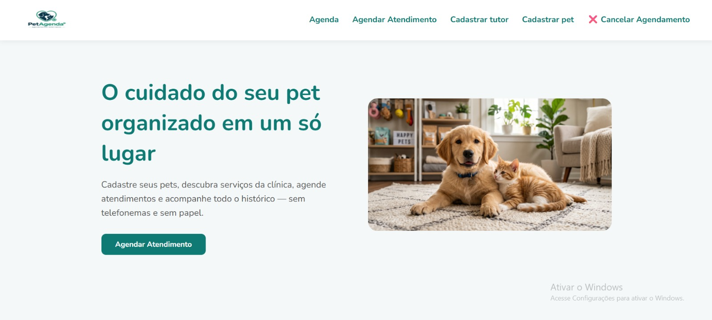
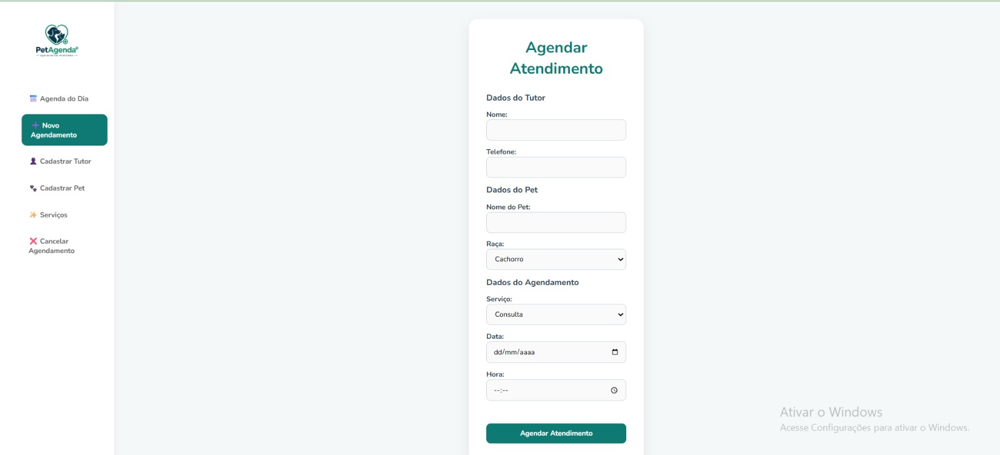
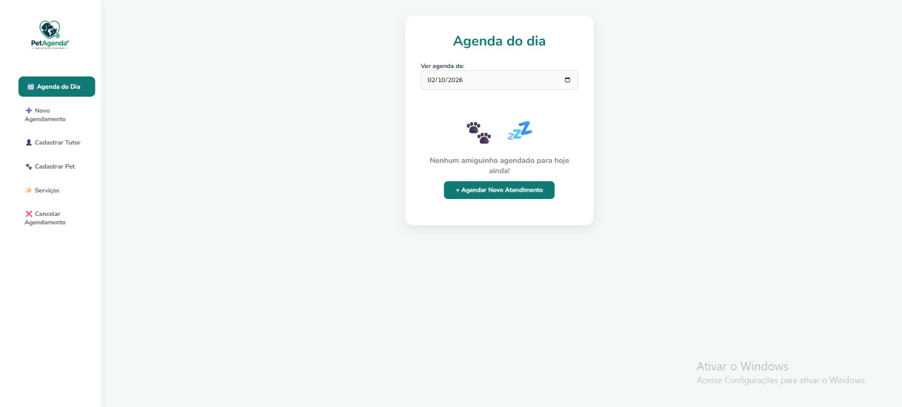
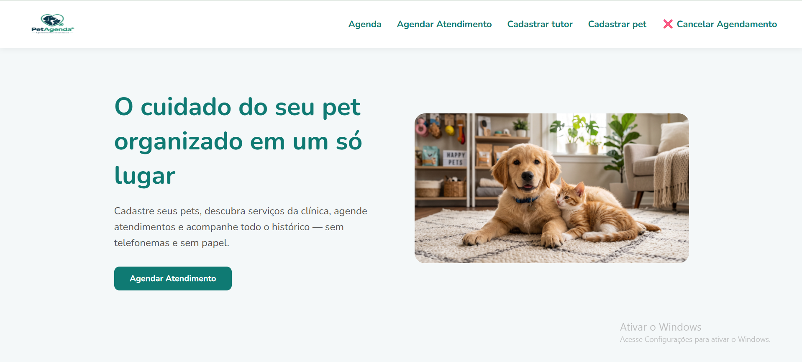
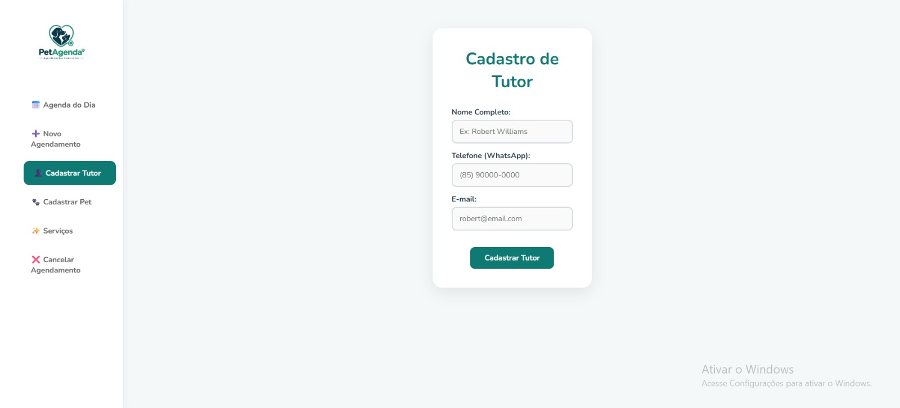
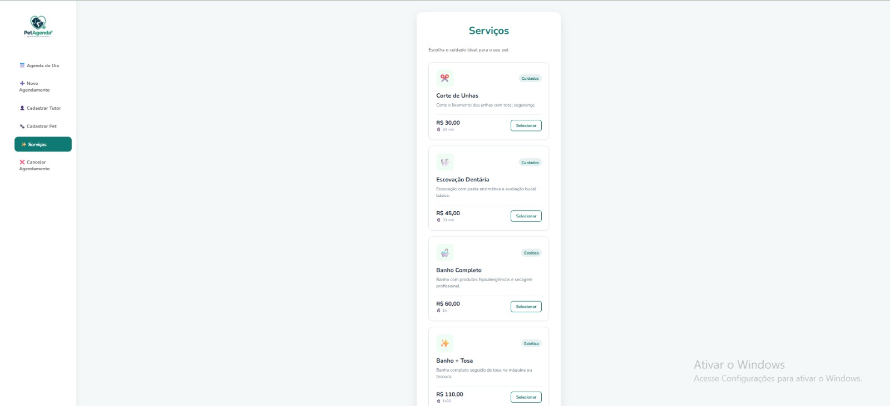
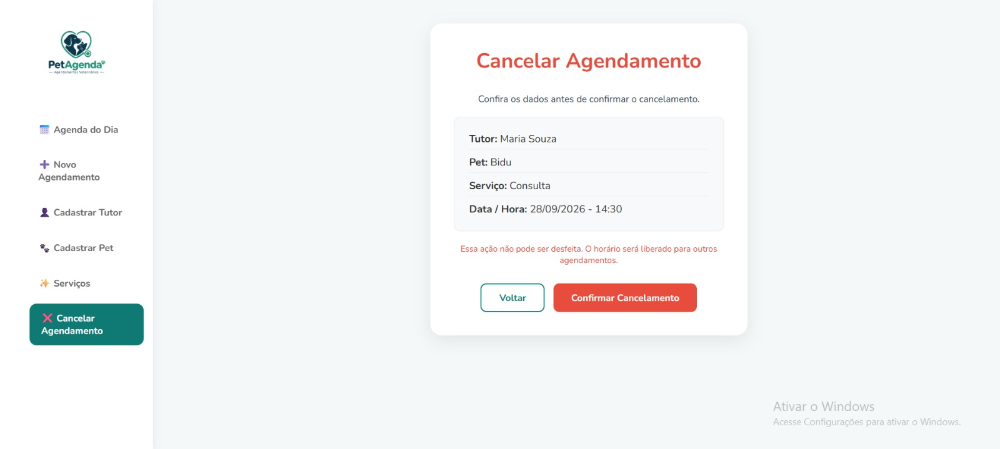

### Sistema de Marcação de Consultas para Animais

Este projeto foi desenvolvido com o objetivo de criar um sistema para marcação de consultas para animais, facilitando o agendamento e a organização dos atendimentos veterinários.


### Tecnologias Utilizadas:

-HTML

-CSS 

-JavaScript

### Funcionalidades

Cadastro de animais.

Cadastro dos responsáveis pelos animais.

Agendamento de consultas.

Seleção de data e horário para atendimento.

### ESTRUTURA DO PROJETO 

```text
Agenda_Vet/
│
├── css/
│   └── arquivos de estilização
│
├── img/
│   └── imagens utilizadas no projeto
│
├── pages/
│   ├── Agendar Atendimento.html
│   ├── cadastro-pet.html
│   ├── cadastro-tutor.html
│   ├── cancelar-agendamento.html
│   ├── index.html
│   ├── lista-de-agendamento.html
│   └── serviços.html
│
├── src/
│   └── arquivos JavaScript e outros recursos
│
├── cadastro.html
│
└── README.md

### DEMOSTRAÇÃO

Tela Incial

Página inicial do sistema, onde o usuário pode acessar as principais funcionalidades do Agenda Vet.



Agendar Atendimento

  Página responsável por visualizar os atendimentos agendados.



Agenda do Dia

Página responsável por apresentar o agendamento de um novo atendimento  



Cadastro de Peds

Página utilizada para cadastrar as informações do animal.



Página utilizada para cadastrar as informações do tutor.

Cadastro de tutor

  
  
  Serviços

Página que apresenta os serviços veterinários disponíveis.
  

Cancelar Agendamento

Página responsável pelo cancelamento de um 
atendimento.

  

  

### INTEGRANTES

Integrantes do Grupo

João Gabriel da Costa Carneiro 

Daniel Angelim Castelo Branco Carneiro

Lucas Andrade Uchoa

Robert Williams de Sousa Jucá
